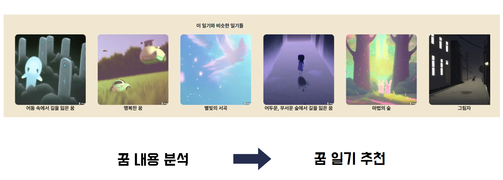
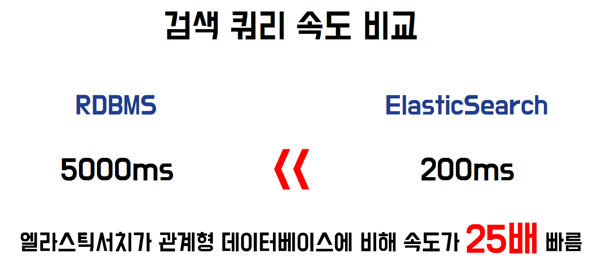

# 🌙 IN A DREAM (SSAFY 9기 부울경 E206 소문난 칠공주)

<br/>

<div align=center>
<br/>
  
</div>

<div align="center">
  <h1>IN A DREAM
  <h3>꿈 일기를 작성하고 꿈을 사고 팔며 거래하는 플랫폼
</h3>
</div>

<!-- <div align="right"><a href="https://(UCC링크)">🎥 UCC 보러 가기</a></div> -->
<br/>

## 📅 기간

- **2023.08.21 ~ 2023.10.06(7주)**

<a name="tableContents"></a>

<br/>

## 🔎 목차

1. <a href="#subject">🎯 기획 배경</a>
1. <a href="#mainContents">⭐️ 주요 기능</a>
1. <a href="#divisionOfDuties">💡 업무 분장</a>
1. <a href="#systemArchitecture">⚙️ 시스템 아키텍쳐</a>
1. <a href="#skills">🛠️ 기술 스택</a>
1. <a href="#directories">🗂️ 파일 구조</a>
1. <a href="#erd">💾 ERD</a>
1. <a href="#contents">🖥️ 화면 소개</a>
1. <a href="#developers">👥 팀원 소개</a>

<br/>

<!------- 주제 시작 -------->

## 🎯 기획 배경

<a name="subject"></a>

**IN A DREAM**

1. <b> 달러구트 꿈백화점 </b>

- 꿈의 구매와 체험 : 달러구트 꿈백화점에서는 방문자들이 꿈을 직접 구매하고 체험할 수 있습니다. 선택한 꿈을 꾸며 다양한 감정과 체험을 경험하게 되죠.
- 감정의 지불 : 꿈에서 느꼈던 감정과 경험은 우리 플랫폼에서의 지불수단이 되며, 이는 우리가 얼마나 강렬한 꿈을 꾸고 싶어하는지를 반영합니다.
  <br/>

2. <b>꿈을 사고 파는 문화</b>

- 길운과 재물운: 꿈에서 특정 동물이나 물건을 보는 것이 어떤 의미를 가질까요? 일부 문화에서는 돼지나 뱀을 꾸면 그것을 길운으로, 동전이나 보석을 찾거나 받으면 그것이 재물운을 의미한다고 해석합니다.
- 꿈의 거래: 이러한 문화 속에서 꿈은 그 자체로 가치를 가지게 되며, 이를 사고 파는 행위가 이루어지게 됩니다.
  <br/>

3. <b>꿈 일기</b>

- 꿈의 기록: 꿈은 많은 사람들이 그 속에서 경험한 감정과 이야기를 기록하고자 하는 소재가 됩니다.
- 일기 작성의 트렌드: 꿈을 기록하면서 그 안에서 얻은 감정과 이야기를 기억에 남기고 싶어하는 사람들이 있습니다.

**"IN A DREAM"** 은 이런 배경 속에서 탄생한 플랫폼으로, 꿈 일기를 작성하고 꿈을 사고 팔면서 그 속에서 나오는 이야기와 감정을 공유하는 공간입니다. 사용자들은 자신의 꿈을 기록하고, 꿈에서 얻은 다양한 이야기와 감정을 서로 나눌 수 있습니다. 또한, 꿈에 등장한 물건이나 상황을 거래할 수 있는 공간도 제공하여, 꿈이 가지는 다양한 가치와 의미를 탐구할 수 있는 기회를 제공합니다.
<br/>

**주요 기능**

- 일기의 키워드를 통한 그림생성
-
-

<div align="right"><a href="#tableContents">목차로 이동</a></div>

<br/>

<!------- 주요 기능 시작 -------->

## ⭐️ 주요 기능

<a name="mainContents"></a>

### 혼자 공부

<h4> 실시간 수업이 종료되면, 학생에게 숙제가 부여됩니다.</h4>

- 학생은 **혼자 공부**에서 받아쓰기, 읽기, 일기 생성, 생성된 일기 읽기를 할 수 있습니다.

<h4>학생의 혼자 공부에서 사용자와 상호작용을 높이기 위해 음성 기반으로 문답을 제공합니다.</h4>

- Speech-To-Text(STT)로 사용자의 발화를 text로 변환해 정답 판별합니다.
- Text-To-Speech(TTS)로 사용자에게 문제를 읽어주고, 피드백 제공합니다.
- Optimal Character Recognition(OCR)로 이미지에 있는 글자를 판별해 받아쓰기 정답을 체크합니다.
- Kakao의 Karlo를 활용해, 학생이 생성한 일기를 그림으로 변환해서 그림일기를 제공합니다.

---

### 실시간 수업

<h4>실시간 교육 기능을 통해 학생들에게 더욱 활발하고 직접적인 교육 경험을 제공합니다.</h4>
<h4>선생님이 반을 선택하여 강의를 생성합니다.</h4>

- 현재 접속 중인 학생들은 SSE 통신을 통해 실시간 알림을 받아 강의 페이지로 자동 이동합니다.
- 앞으로 로그인하는 학생들은 실시간 강의 여부에 따라 강의 페이지로 자동 이동합니다.

<h4>실시간 강의에서는 단순한 화상 통화를 넘어, 다양한 보조 기능들을 통해 효과적인 교육을 지원합니다.</h4>

- 선생님의 마우스 포인터 위치를 실시간으로 학생들에게 보여주는 마우스 트레이싱 기능이 탑재되어 있어, 학생들이 선생님의 지시를 쉽게 파악할 수 있습니다.
- 선생님이 학생의 페이지를 원격으로 제어하거나, 자신의 페이지 이동을 학생에게도 동기화시켜 수업의 질을 높입니다.
- 선생님이 학생들의 마이크를 제어하여 수업이 원활하게 진행 될 수 있습니다.

<div align="right"><a href="#tableContents">목차로 이동</a></div>

<br/>

## 🌟 주요 차별점

### 노인을 위한 서비스란?

<h4>저희 생각에는 단순히 글자가 크고, 심플한 디자인이 노인을 위한 서비스라 생각하였습니다.</h4>
<h4>하지만, 그게 정말 노인을 위한 서비스일까요?</h4>
<h4>저희는 이에 대한 답을 찾기 위해 여러 논문 자료를 참고하여 제작하였습니다.</h4>

- 노인은 눈동자의 황변으로 하위범주 (파랑, 초록)보다 상위범주(노랑, 빨강)에서 잘 식별한다.
  - 김응철, 김후성.(2020), 치매 예방을 위한 교구재 디자인 색상 적용 연구
- 백색 바탕에 검정 문자에서 높은 가독성을 보였다.
  - 정신해, 손정식, 곽호원, 유동식.(2014), 노안 연령에서 배경색에 따른 한글서체의 가독성 평가
- 서체 선호도 및 가독성 2차 설문 조사 결과 ➡️ Kopub 바탕체
- 노인은 필요없는 정보를 식별하는 시각 판별력이 떨어진다.
  - 미국 브라운대 인식언어 및 심리학과 타케오 와타나베 교수, 노인 시간 판별력 실험
- 반응속도가 늦어지고, 정보처리과정에서 저장된 정보를 적시에 이용하지 못하는 등 기억력 감퇴의 학습 장애의 요인을 갖고 있다. ➡️ 반복 학습 필요성
  - 최예식.(2020), 언택트 시대 노인 학습자 일상 변화의 연구: 복지관 이용자를 중심으로
- 교육에 대해 만족도가 높았으나, 교육의 활용도에 만족도가 낮은 것으로 나타나 실생활과 연계된 교육프로그램을 강화할 필요가... ➡️ 실생활과 관련된 커리큘럼 구성
  - 김정엽, 이재모.(2010), 노인 교육에 관한 노인의 욕구분석 -노인의 연령별 차이를 중심으로-

<div align="right"><a href="#tableContents">목차로 이동</a></div>

<br/>

<!------- 업무 분장 시작 -------->

## 💡 업무 분장

<a name="divisionOfDuties"></a>

#### FrontEnd

- **윤자현** : UI/UX 구현, 요구사항 분석 및 설계, three.js 및 애니메이션을 사용해 인터렉티브 화면 구현
- **김동현** : UI/UX 구현, Redux, React Query를 활용해 데이터 상태 관리, 인터렉티브 메인 화면 구현

- **김현빈** : UI/UX 구현, three.js 및 애니메이션을 사용해 인터렉티브 화면 구현, 성능 최적화
- **정수완** : UI/UX 구현, CR(Create, Read) 기능 구현해 전반적인 페이지 개발, 반응형 웹 디자인 구현
  <br/>

#### BackEnd

- **이승민** : spring boot api 개발, ELk Stack을 활용한 로그 관리 및 데이터 분석, 검색엔진, 거래내역 이상징후 탐지, 추천기능
- **차민준** : spring boot api 개발, jenkins/docker를 활용한 ci/cd 자동화 구축 spark를 활용한 빅데이터 분석
- **조현덕** : 빅데이터 시스템 구축, spark를 활용한 빅데이터 분석, spark streaming을 실시간 데이터 처리, spring boot api 개발

<div align="right"><a href="#tableContents">목차로 이동</a></div>
<br/>
<!------- 시스템 아키텍쳐 시작 -------->

## ⚙️ 시스템 아키텍쳐

<a name="systemArchitecture"></a>


<div align="right"><a href="#tableContents">목차로 이동</a></div>

<br/>

<!------- 기술 스택 시작 -------->

## 🛠️ 기술 스택

<a name="skills"></a>

<!-- -(색깔)?style=for-the-badge&logo=(이름)&logoColor=white>) -->

### 프론트

  
  
   

 
 


---

### 백엔드

   

   
 
 

 &logoColor=white>)
 

---

### 협업

   

<div align="right"><a href="#tableContents">목차로 이동</a></div>

<br/>

<!------- 파일 구조 시작 -------->

## 🗂️ 파일 구조

<a name="directories"></a>

### 프론트

<details>
  <summary>
    자세히
  </summary>

```
📦front
 ┣ 📂node_modules
 ┣ 📂public
 ┃ ┣ 📂card
 ┃ ┣ 📂CardSplit
 ┃ ┣ 📂fonts
 ┃ ┗ 📂Video
 ┣ 📂src
 ┃ ┣ 📂api
 ┃ ┃ ┣ 📂instances
 ┃ ┃ ┗ 📂services
 ┃ ┣ 📂assets
 ┃ ┃ ┣ 📂background
 ┃ ┃ ┣ 📂coin
 ┃ ┃ ┣ 📂logo
 ┃ ┃ ┗ 📂navbar
 ┃ ┣ 📂components
 ┃ ┃ ┣ 📂common
 ┃ ┃ ┣ 📂features
 ┃ ┃ ┃ ┣ 📂BarGraph
 ┃ ┃ ┃ ┣ 📂CalendarComponents
 ┃ ┃ ┃ ┣ 📂Card
 ┃ ┃ ┃ ┃ ┗ 📂styles
 ┃ ┃ ┃ ┣ 📂CardDeck
 ┃ ┃ ┃ ┣ 📂CardSplit
 ┃ ┃ ┃ ┣ 📂CircleGraph
 ┃ ┃ ┃ ┣ 📂CloudComponents
 ┃ ┃ ┃ ┣ 📂CreateDreamDiary
 ┃ ┃ ┃ ┣ 📂DetailETC
 ┃ ┃ ┃ ┣ 📂DiaryDrrList
 ┃ ┃ ┃ ┣ 📂ExchageCoin
 ┃ ┃ ┃ ┣ 📂GalleryComponents
 ┃ ┃ ┃ ┣ 📂ImgScrollCardBox
 ┃ ┃ ┃ ┣ 📂ImgSlide
 ┃ ┃ ┃ ┣ 📂IntroComponents
 ┃ ┃ ┃ ┣ 📂KeywordCloud
 ┃ ┃ ┃ ┣ 📂LoadingComponents
 ┃ ┃ ┃ ┣ 📂LoginComponentsx
 ┃ ┃ ┃ ┣ 📂MouseCursor
 ┃ ┃ ┃ ┣ 📂NavbarComponents
 ┃ ┃ ┃ ┃ ┗ 📂styles
 ┃ ┃ ┃ ┣ 📂RecommendedDiary
 ┃ ┃ ┃ ┣ 📂SearchBarComponents
 ┃ ┃ ┃ ┣ 📂SignupComponents
 ┃ ┃ ┃ ┗ 📂Statics
 ┃ ┃ ┗ 📂layout
 ┃ ┃ ┃ ┗ 📂styles
 ┃ ┣ 📂hooks
 ┃ ┣ 📂pages
 ┃ ┃ ┣ 📂styles
 ┃ ┣ 📂stores
 ┃ ┃ ┣ 📂actions
 ┃ ┃ ┗ 📂reducers
 ┃ ┗ 📂types
 ┣ 📜.gitignore
 ┣ 📜Dockerfile
 ┣ 📜package-lock.json
 ┣ 📜package.json
 ┣ 📜README.md
 ┗ 📜tsconfig.json
```

</details>

### 백엔드

<details>
  <summary>
    자세히
  </summary>

```
📦back
 ┣ 📂dream
 ┃ ┣ 📂elastic
 ┃ ┃ ┣ 📂elasticsearch
 ┃ ┃ ┣ 📂kibana
 ┃ ┃ ┗ 📂logstash
 ┃ ┣ 📂gradle
 ┃ ┣ 📂src
 ┃ ┃ ┣ 📂main
 ┃ ┃ ┃ ┗ 📂java
 ┃ ┃ ┃ ┃ ┗ 📂com
 ┃ ┃ ┃ ┃ ┃ ┗ 📂dream
 ┃ ┃ ┃ ┃ ┃ ┃ ┗ 📂dream
 ┃ ┃ ┃ ┃ ┃ ┃ ┃ ┣ 📂auth
 ┃ ┃ ┃ ┃ ┃ ┃ ┃ ┣ 📂diary
 ┃ ┃ ┃ ┃ ┃ ┃ ┃ ┣ 📂elasticsearch
 ┃ ┃ ┃ ┃ ┃ ┃ ┃ ┣ 📂emotion
 ┃ ┃ ┃ ┃ ┃ ┃ ┃ ┣ 📂exception
 ┃ ┃ ┃ ┃ ┃ ┃ ┃ ┣ 📂jwt
 ┃ ┃ ┃ ┃ ┃ ┃ ┃ ┣ 📂kafka
 ┃ ┃ ┃ ┃ ┃ ┃ ┃ ┣ 📂member
 ┃ ┃ ┃ ┃ ┃ ┃ ┃ ┣ 📂recommend
 ┃ ┃ ┃ ┃ ┃ ┃ ┃ ┣ 📂response
 ┃ ┃ ┃ ┃ ┃ ┃ ┃ ┣ 📂search
 ┃ ┃ ┃ ┃ ┃ ┃ ┃ ┣ 📂statistic
 ┃ ┃ ┃ ┃ ┃ ┃ ┃ ┣ 📂swagger
 ┃ ┃ ┃ ┃ ┃ ┃ ┃ ┗ 📂transaction
 ┃ ┃ ┗ 📂test
 ┣ 📂elastic
 ┃ ┣ 📂elasticsearch
 ┃ ┃ ┣ 📂data
 ┃ ┃ ┃ ┗ 📂nodes
 ┃ ┣ 📂kibana
 ┃ ┣ 📂logstash
 ┃ ┃ ┣ 📂drivers
 ┃ ┃ ┣ 📂pipeline
 ┃ ┗ 📜docker-compose-elastic.yml
```

</details>

<div align="right"><a href="#tableContents">목차로 이동</a></div>

<br/>

<!------- ERD 시작 -------->

## 💾 ERD

<a name="erd"></a>


<div align="right"><a href="#tableContents">목차로 이동</a></div>

<br/>

<!------- 화면 소개 시작 -------->

<a name="contents"></a>

<br/>

## 🖥️ 화면 소개

### 1. 인트로 페이지

<div align=center>

</div>

- face-api.js를 활용해 얼굴 로그인을 진행합니다.
- 로그인은 박스 영역에 들어와야 로그인 진행이 됩니다.
- 사용자가 박스 영역에 잘 들어올 수 있도록 TTS로 얼굴 이동을 안내합니다.

### 2. 인트로 to login

<div align=center display=flex>


</div>

<h3>기능</h3>

- 실시간 수업 시작
- 야학 단체에 등록된 학생 확인
- 학습 교재 확인

### 3. Login

<h3>실시간 수업 시작</h3>
<div align=center>

</div>

- 수업을 시작을 누르면, 학생들은 실시간 수업으로 들어올 수 있습니다.

<h3>MainPage</h3>
<div align=center>

</div>

- 수업을 위해 교사는 커리큘럼과 강의 자료를 선택합니다.
- 강의자료 선택 후, 단어 읽기, 단어 받아쓰기 등의 수업을 진행합니다.

<h4>Cloud</h4>
<div align=center>

</div>

<h4>MyPage</h4>
<div align=center>

</div>

<h4>Shop</h4>
<div align=center>

</div>

### 4. 학생 메인 페이지

<div align=center>

</div>

<h3>기능</h3>
  
  - 실시간 수업 : 강사가 방을 열었을 경우 자동 참여
  - 혼자 공부하기
  - 일기장 보기

### 5. 학생 실시간 페이지

<h3>실시간 수업 입장</h3>
<div align=center>

</div>

---

<div align=center>

</div>

<h3>수업</h3>
<div align=center>


</div>

- 학생들은 강사가 공유하는 교재를 보며 실시간 수업을 받습니다.
- 단어 읽기, 받아쓰기 등의 수업이 진행됩니다.

<h4>단어 읽기</h4>
<div align=center>
</div>
<h4>단어 힌트 - 단어 읽기 힘들어 할 경우</h4>
<div align=center>





</div>
<h4>단어 받아쓰기</h4>
<div align=center>

</div>

### 6. 혼자 공부하기

<div align=center>

</div>

---

<div align=center>

</div>

<h3>기능</h3>

- 단어 읽고, 받아쓰기
- 오늘의 일기 생성 및 읽기

---

<h4>단어 읽기</h4>
<div align=center>

</div>

- 학생의 음성을 통해 정답 판별을 합니다.

<h4>공책 선택</h4>
<div align=center>

</div>

<h4>받아쓰기 - 공책 없음</h4>
<div align=center>

</div>

- 공책이 없는 경우, 캔버스를 통해서 받아쓰기를 할 수 있습니다.

<h4>받아쓰기 - 공책 있음</h4>
<div align=center>

</div>

- OCR을 통해 사진에 있는 text를 인식해 정답을 비교합니다.

---

<h4>일기 생성</h4>
<div align=center>

</div>

- 사용자와의 대화를 기반으로 일기를 생성합니다.

<h4>생성된 일기로 읽기</h4>
<div align=center>

</div>

- 일기 완성 후 생성된 일기 내용으로 학습을 이어갑니다.
- 일기 내용을 기반으로 그림일기도 제공합니다.

### 7. 일기

<div align=center>

</div>

- 혼자 공부를 통해 생성된 일기들을 볼 수 있습니다.

<div align="right"><a href="#tableContents">목차로 이동</a></div>

<br/>

<!------- 팀원 소개 시작 -------->

## 👥 팀원 소개

<a name="developers"></a>

|   **Name**   |                       윤자현                       |                       김동현                       |                       김현빈                       |                       정수완                       |                                      이승민                                       |                       조현덕                       |                       차민준                       |
| :----------: | :------------------------------------------------: | :------------------------------------------------: | :------------------------------------------------: | :------------------------------------------------: | :-------------------------------------------------------------------------------: | :------------------------------------------------: | :------------------------------------------------: |
| **Profile**  |  |  |  |  |                                 |  |  |
| **Position** |               Leader <br/> Frontend                |                      Frontend                      |                      Frontend                      |                      Frontend                      |                                      Backend                                      |                      Backend                       |                      Backend                       |
|   **Git**    |      [GitHub](https://github.com/YOONJAHYUN)       |     [GitHub](https://github.com/dongdongx2x2)      |     [GitHub](https://github.com/HyeonBhinKim)      |       [GitHub](https://github.com/SWan9710)        | [GitHub](https://github.com/SMin1620) <br/> [Blog](https://smin1620.tistory.com/) |       [GitHub](https://github.com/whwhdnfl2)       |      [GitHub](https://github.com/gusejr4547)       |

<div align="right"><a href="#tableContents">목차로 이동</a></div>
