# 🌙 IN A DREAM (SSAFY 9기 부울경 E206 소문난 칠공주)

<br/>

<div align=center>
<br/>
  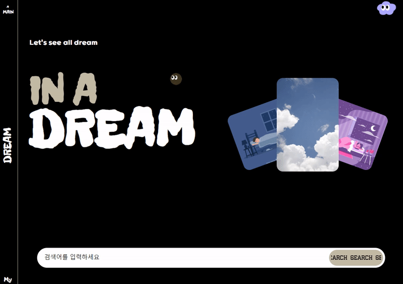
</div>

<div align="center">
  <h1>IN A DREAM
  <h3>꿈 일기를 작성하고 꿈을 사고 팔며 거래하는 플랫폼
</h3>
</div>

<!-- <div align="right"><a href="https://(UCC링크)">🎥 UCC 보러 가기</a></div> -->
<br/>

## 📅 기간

- **2023.08.21 ~ 2023.10.06(7주)**

<a name="tableContents"></a>

<br/>

## 🔎 목차

1. <a href="#subject">🎯 기획 배경</a>
1. <a href="#mainContents">⭐️ 주요 기능</a>
1. <a href="#divisionOfDuties">💡 업무 분장</a>
1. <a href="#systemArchitecture">⚙️ 시스템 아키텍쳐</a>
1. <a href="#skills">🛠️ 기술 스택</a>
1. <a href="#directories">🗂️ 파일 구조</a>
1. <a href="#erd">💾 ERD</a>
1. <a href="#contents">🖥️ 화면 소개</a>
1. <a href="#developers">👥 팀원 소개</a>

<br/>

<!------- 주제 시작 -------->

## 🎯 기획 배경

<a name="subject"></a>

**IN A DREAM**

1. <b> 달러구트 꿈백화점 </b>

- 꿈의 구매와 체험 : 달러구트 꿈백화점에서는 방문자들이 꿈을 직접 구매하고 체험할 수 있습니다. 선택한 꿈을 꾸며 다양한 감정과 체험을 경험하게 되죠.
- 감정의 지불 : 꿈에서 느꼈던 감정과 경험은 우리 플랫폼에서의 지불수단이 되며, 이는 우리가 얼마나 강렬한 꿈을 꾸고 싶어하는지를 반영합니다.
  <br/>

2. <b>꿈을 사고 파는 문화</b>

- 길운과 재물운: 꿈에서 특정 동물이나 물건을 보는 것이 어떤 의미를 가질까요? 일부 문화에서는 돼지나 뱀을 꾸면 그것을 길운으로, 동전이나 보석을 찾거나 받으면 그것이 재물운을 의미한다고 해석합니다.
- 꿈의 거래: 이러한 문화 속에서 꿈은 그 자체로 가치를 가지게 되며, 이를 사고 파는 행위가 이루어지게 됩니다.
  <br/>

3. <b>꿈 일기</b>

- 꿈의 기록: 꿈은 많은 사람들이 그 속에서 경험한 감정과 이야기를 기록하고자 하는 소재가 됩니다.
- 일기 작성의 트렌드: 꿈을 기록하면서 그 안에서 얻은 감정과 이야기를 기억에 남기고 싶어하는 사람들이 있습니다.

**"IN A DREAM"** 은 이런 배경 속에서 탄생한 플랫폼으로, 꿈 일기를 작성하고 꿈을 사고 팔면서 그 속에서 나오는 이야기와 감정을 공유하는 공간입니다. 사용자들은 자신의 꿈을 기록하고, 꿈에서 얻은 다양한 이야기와 감정을 서로 나눌 수 있습니다. 또한, 꿈에 등장한 물건이나 상황을 거래할 수 있는 공간도 제공하여, 꿈이 가지는 다양한 가치와 의미를 탐구할 수 있는 기회를 제공합니다.
<br/>

<div align="right"><a href="#tableContents">목차로 이동</a></div>

<br/>

<!------- 주요 기능 시작 -------->

## ⭐️ 주요 기능

<a name="mainContents"></a>

### 꿈 일기 작성

- 사용자가 꿈 일기를 작성합니다.
- 꿈 내용을 통해 그림이 자동 생성됩니다.
- 꿈 내용을 분석하여 해당 꿈의 감정을 추출하고, 해당 감정만큼 감정코인을 얻게됩니다.

<h4> Kakao의 Karlo를 활용해, 그림일기를 제공합니다.</h4>

---

### 꿈 거래

- 다른 사용자가 작성한 꿈을, 해당 감정만큼 지불하여 꿈을 구매합니다.

---

### 꿈 통계

- 설정된 기간에 따른, 사용자의 꿈의 키워드 분석 및 감정 분석을 통해 꿈 키워드와 감정을 한꺼번에 볼 수 있습니다.

---

### 꿈 추천

- 사용자의 로그를 분석해 사용자에게 맞는 꿈을 추천해줍니다.
- 꿈을 분석해 비슷한 꿈을 분석해줍니다.

<br/>

<!------- 시스템 아키텍쳐 시작 -------->

## ⚙️ 시스템 아키텍쳐

<a name="systemArchitecture"></a>

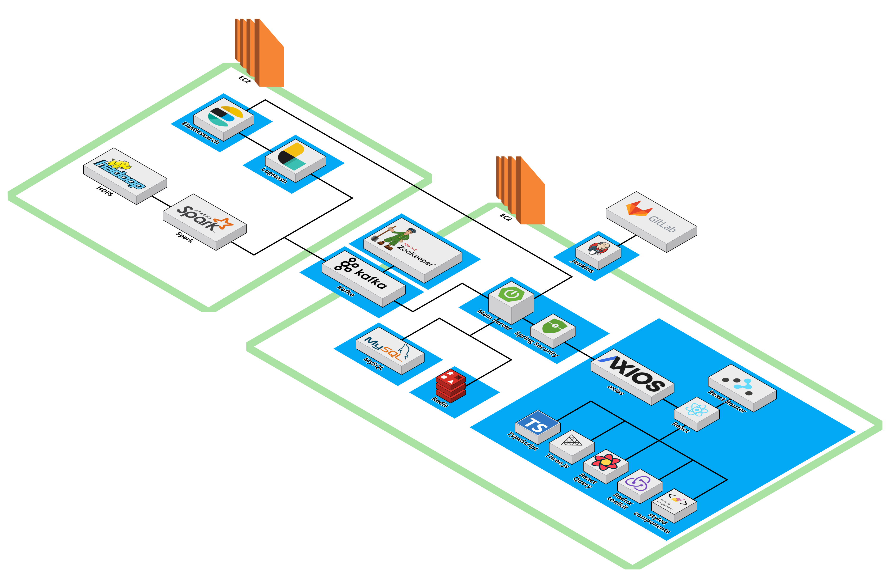

<br/>

<!------- 기술 스택 시작 -------->

## 🛠️ 기술 스택

<a name="skills"></a>

<!-- -(색깔)?style=for-the-badge&logo=(이름)&logoColor=white>) -->

### 프론트

  
  
   

 
 


---

### 백엔드

   

   
 
 

 &logoColor=white>)
 

---

### 협업

   

<div align="right"><a href="#tableContents">목차로 이동</a></div>

<br/>

<!------- 파일 구조 시작 -------->

## 🗂️ 파일 구조

<a name="directories"></a>

### 프론트

<details>
  <summary>
    자세히
  </summary>

```
📦front
 ┣ 📂node_modules
 ┣ 📂public
 ┃ ┣ 📂card
 ┃ ┣ 📂CardSplit
 ┃ ┣ 📂fonts
 ┃ ┗ 📂Video
 ┣ 📂src
 ┃ ┣ 📂api
 ┃ ┃ ┣ 📂instances
 ┃ ┃ ┗ 📂services
 ┃ ┣ 📂assets
 ┃ ┃ ┣ 📂background
 ┃ ┃ ┣ 📂coin
 ┃ ┃ ┣ 📂logo
 ┃ ┃ ┗ 📂navbar
 ┃ ┣ 📂components
 ┃ ┃ ┣ 📂common
 ┃ ┃ ┣ 📂features
 ┃ ┃ ┃ ┣ 📂BarGraph
 ┃ ┃ ┃ ┣ 📂CalendarComponents
 ┃ ┃ ┃ ┣ 📂Card
 ┃ ┃ ┃ ┃ ┗ 📂styles
 ┃ ┃ ┃ ┣ 📂CardDeck
 ┃ ┃ ┃ ┣ 📂CardSplit
 ┃ ┃ ┃ ┣ 📂CircleGraph
 ┃ ┃ ┃ ┣ 📂CloudComponents
 ┃ ┃ ┃ ┣ 📂CreateDreamDiary
 ┃ ┃ ┃ ┣ 📂DetailETC
 ┃ ┃ ┃ ┣ 📂DiaryDrrList
 ┃ ┃ ┃ ┣ 📂ExchageCoin
 ┃ ┃ ┃ ┣ 📂GalleryComponents
 ┃ ┃ ┃ ┣ 📂ImgScrollCardBox
 ┃ ┃ ┃ ┣ 📂ImgSlide
 ┃ ┃ ┃ ┣ 📂IntroComponents
 ┃ ┃ ┃ ┣ 📂KeywordCloud
 ┃ ┃ ┃ ┣ 📂LoadingComponents
 ┃ ┃ ┃ ┣ 📂LoginComponentsx
 ┃ ┃ ┃ ┣ 📂MouseCursor
 ┃ ┃ ┃ ┣ 📂NavbarComponents
 ┃ ┃ ┃ ┃ ┗ 📂styles
 ┃ ┃ ┃ ┣ 📂RecommendedDiary
 ┃ ┃ ┃ ┣ 📂SearchBarComponents
 ┃ ┃ ┃ ┣ 📂SignupComponents
 ┃ ┃ ┃ ┗ 📂Statics
 ┃ ┃ ┗ 📂layout
 ┃ ┃ ┃ ┗ 📂styles
 ┃ ┣ 📂hooks
 ┃ ┣ 📂pages
 ┃ ┃ ┣ 📂styles
 ┃ ┣ 📂stores
 ┃ ┃ ┣ 📂actions
 ┃ ┃ ┗ 📂reducers
 ┃ ┗ 📂types
 ┣ 📜.gitignore
 ┣ 📜Dockerfile
 ┣ 📜package-lock.json
 ┣ 📜package.json
 ┣ 📜README.md
 ┗ 📜tsconfig.json
```

</details>

### 백엔드

<details>
  <summary>
    자세히
  </summary>

```
📦back
 ┣ 📂dream
 ┃ ┣ 📂elastic
 ┃ ┃ ┣ 📂elasticsearch
 ┃ ┃ ┣ 📂kibana
 ┃ ┃ ┗ 📂logstash
 ┃ ┣ 📂gradle
 ┃ ┣ 📂src
 ┃ ┃ ┣ 📂main
 ┃ ┃ ┃ ┗ 📂java
 ┃ ┃ ┃ ┃ ┗ 📂com
 ┃ ┃ ┃ ┃ ┃ ┗ 📂dream
 ┃ ┃ ┃ ┃ ┃ ┃ ┗ 📂dream
 ┃ ┃ ┃ ┃ ┃ ┃ ┃ ┣ 📂auth
 ┃ ┃ ┃ ┃ ┃ ┃ ┃ ┣ 📂diary
 ┃ ┃ ┃ ┃ ┃ ┃ ┃ ┣ 📂elasticsearch
 ┃ ┃ ┃ ┃ ┃ ┃ ┃ ┣ 📂emotion
 ┃ ┃ ┃ ┃ ┃ ┃ ┃ ┣ 📂exception
 ┃ ┃ ┃ ┃ ┃ ┃ ┃ ┣ 📂jwt
 ┃ ┃ ┃ ┃ ┃ ┃ ┃ ┣ 📂kafka
 ┃ ┃ ┃ ┃ ┃ ┃ ┃ ┣ 📂member
 ┃ ┃ ┃ ┃ ┃ ┃ ┃ ┣ 📂recommend
 ┃ ┃ ┃ ┃ ┃ ┃ ┃ ┣ 📂response
 ┃ ┃ ┃ ┃ ┃ ┃ ┃ ┣ 📂search
 ┃ ┃ ┃ ┃ ┃ ┃ ┃ ┣ 📂statistic
 ┃ ┃ ┃ ┃ ┃ ┃ ┃ ┣ 📂swagger
 ┃ ┃ ┃ ┃ ┃ ┃ ┃ ┗ 📂transaction
 ┃ ┃ ┗ 📂test
 ┣ 📂elastic
 ┃ ┣ 📂elasticsearch
 ┃ ┃ ┣ 📂data
 ┃ ┃ ┃ ┗ 📂nodes
 ┃ ┣ 📂kibana
 ┃ ┣ 📂logstash
 ┃ ┃ ┣ 📂drivers
 ┃ ┃ ┣ 📂pipeline
 ┃ ┗ 📜docker-compose-elastic.yml
```

</details>

<div align="right"><a href="#tableContents">목차로 이동</a></div>

<br/>

<!------- ERD 시작 -------->

## 💾 ERD

<a name="erd"></a>

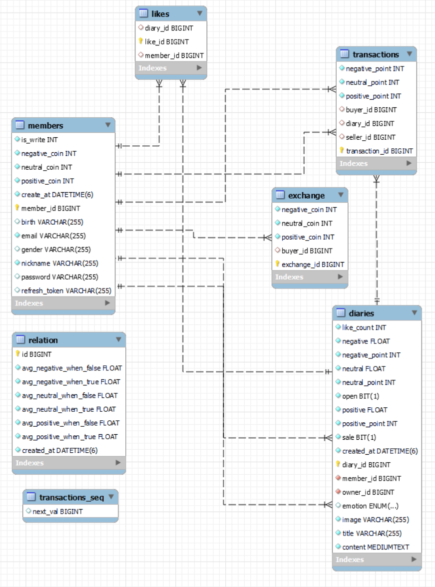

<div align="right"><a href="#tableContents">목차로 이동</a></div>

<br/>

<!------- 화면 소개 시작 -------->

<a name="contents"></a>

<br/>

## 🖥️ 화면 소개

### 1. 인트로 페이지

<div align=center>

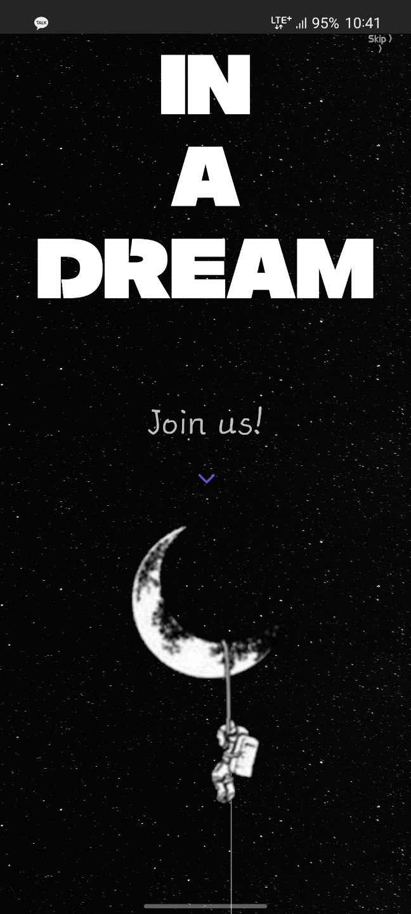
</div>

- 사이트의 대략적인 분위기와 기획의도를 설명해주며 꿈을 주제로 하는만큼 감성적인 요소와 인터렉티브한 요소들을 사용하여 사용자에게 사이트 이용에 몰입감을 제공해 줍니다.

### 2. 인트로 to login

<div align=center display=flex>
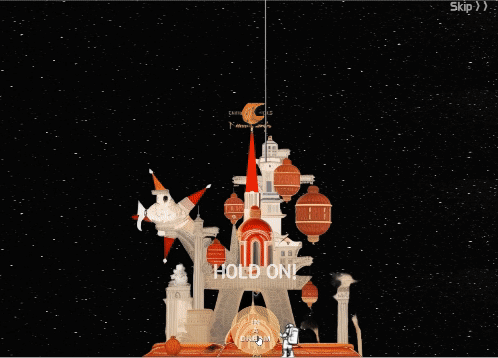
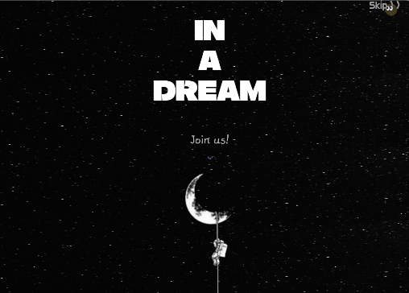
</div>

- 성에 들어가는 느낌을 주어, 몰입감을 향상시킵니다.

### 3. Login

<div align=center>
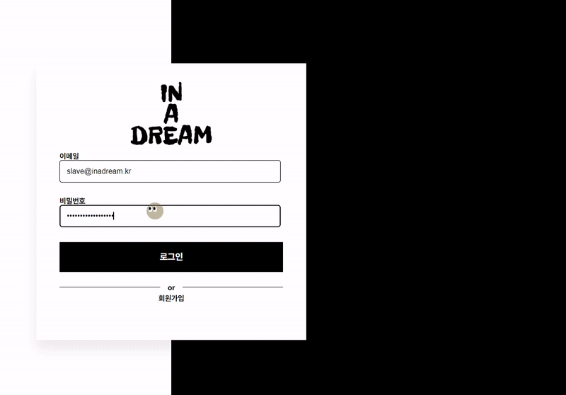
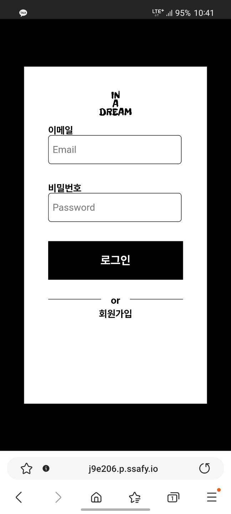

</div>

### 4. MainPage

<div align=center>


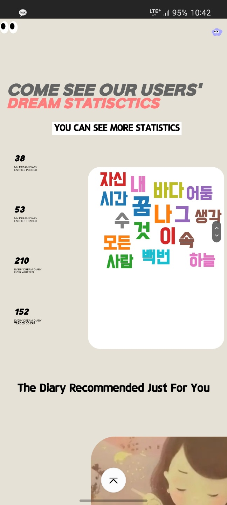
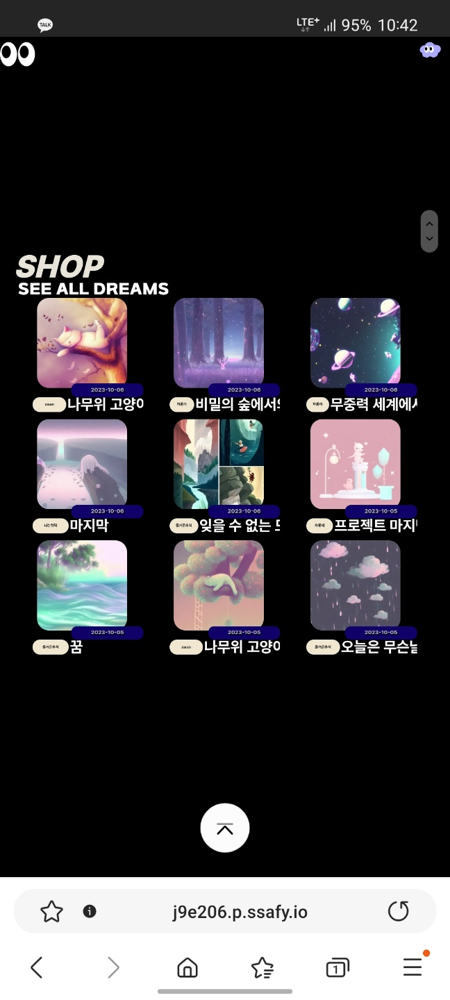

</div>

- 웹사이트의 모든 기능을 보여주는 화면입니다.
- 인터랙티브 요소를 추가하여 사용자에게 즐거움을 제공합니다.

### 5. Cloud

<div align=center>
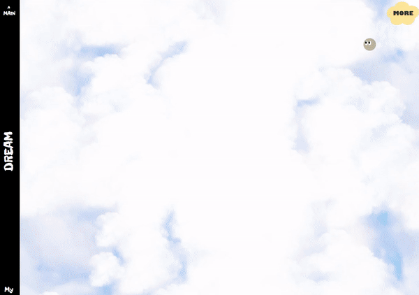
</div>
- 전체 꿈 일기를 볼 수 있는 페이지입니다.
- three.js를 활용하여 제작해, 꿈과 같은 몽환적인 느낌을 줍니다.

### 6. Mypage

<div align=center>
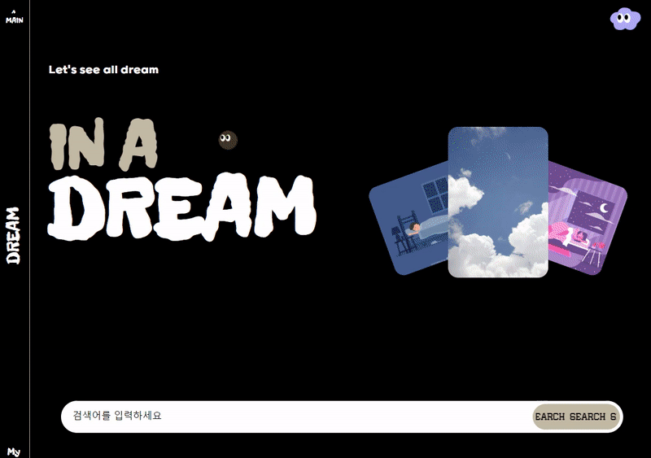
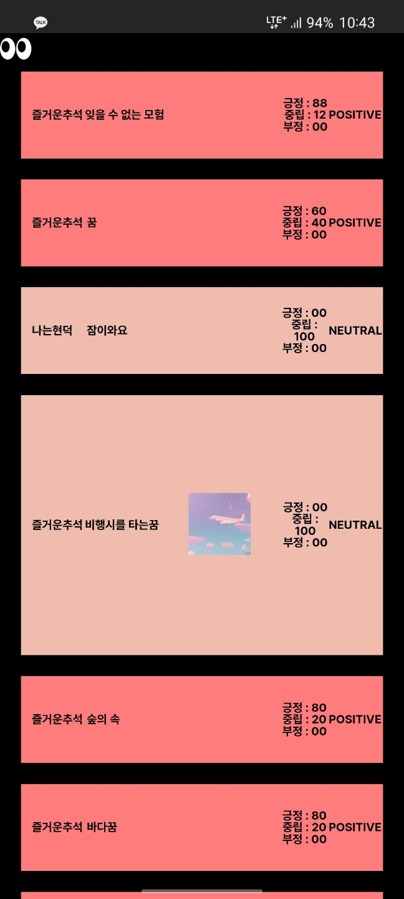

</div>
- 사용자만의 일기 작성 스태틱, 감정, 키워드를 한 눈에 볼 수 있습니다.
- 사용자가 직접 소유한 일기를 볼 수 있습니다.

### 7. ShopPgage

<div align=center>


</div>
- 구매가 가능한 꿈 일기를 모두 모아볼 수 있습니다.
- 인피니티 스크롤을 사용하여 api 요청을 처리하였고, 아래에 도착시 새로운 일기정보들이 인터렉티브하게 표시됩니다.

### 8. StaticsPgage

<div align=center>
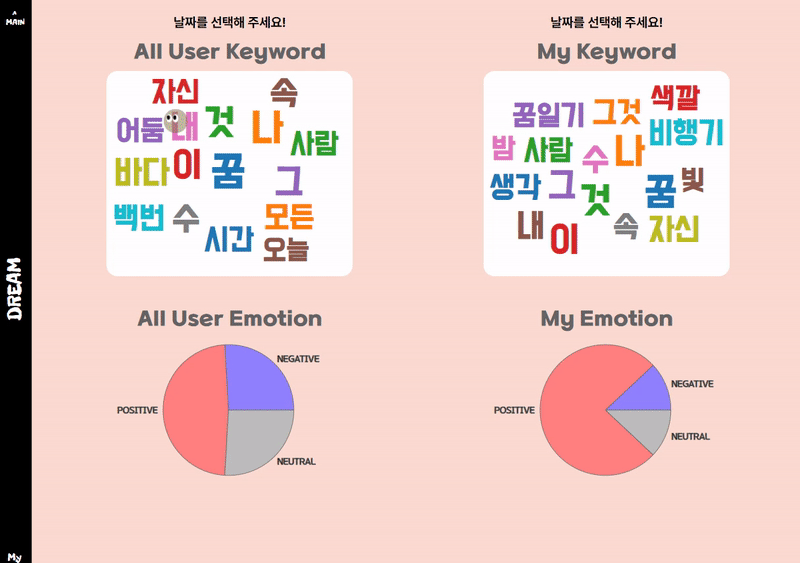
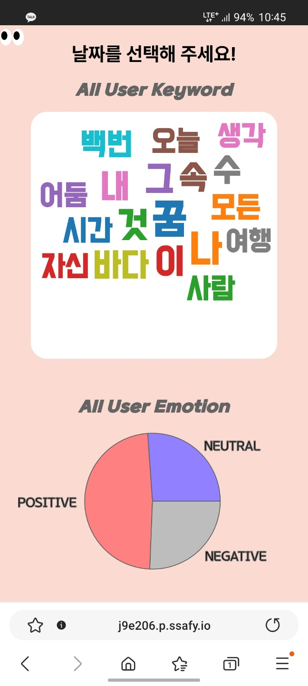
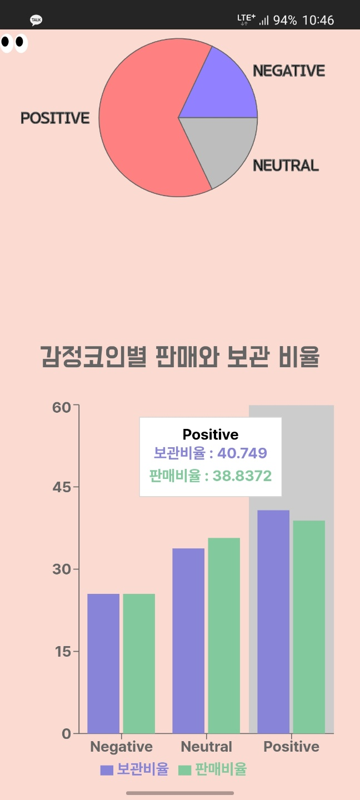

</div>
- 기간을 설정해 모든 유저의 키워드, 감정을 한 눈에 볼 수 있습니다.
- 기간을 설정해 나의 키워드, 감정을 한 눈에 볼 수 있습니다.
- 작성된 일기의 감정별 판매여부와 보관여부의 비율을 볼 수 있습니다. 이를 통해 사용자의 감정에 따라 판매를 얼마나 하고 싶은지 상관관계를 예측할 수 있습니다.

### 9. GalleryPgage

<div align=center>

</div>
- 감정별 탑 8개의 일기를 보여주며, three.js를 활용해 실제 갤러리에 있는 듯한 느낌을 구현했습니다.

### 10. 꿈 일기 작성

<h3>수업</h3>
<div align=center>
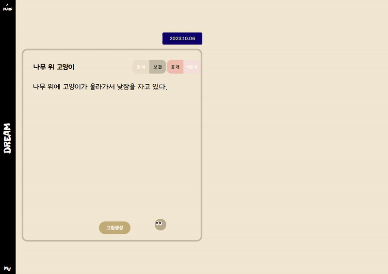
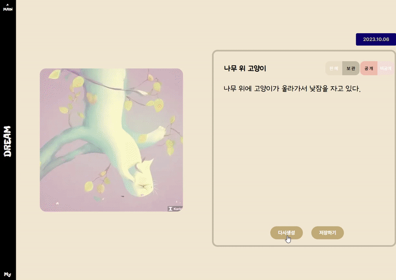


</div>

- 꿈 일기를 작성하고, 이미지를 생성합니다.
- 이미지가 마음에 들지 않을 경우, 다시 생성이 가능하고 코인을 5개 지불해야 합니다.

### 11. 꿈 추천

<div align=center>
</div>
- 사용자의 로그를 분석하여 꿈을 추천해줍니다.

<br/>

## 🖥️ 기술

### 1. 형태소 분석

<div align=center>
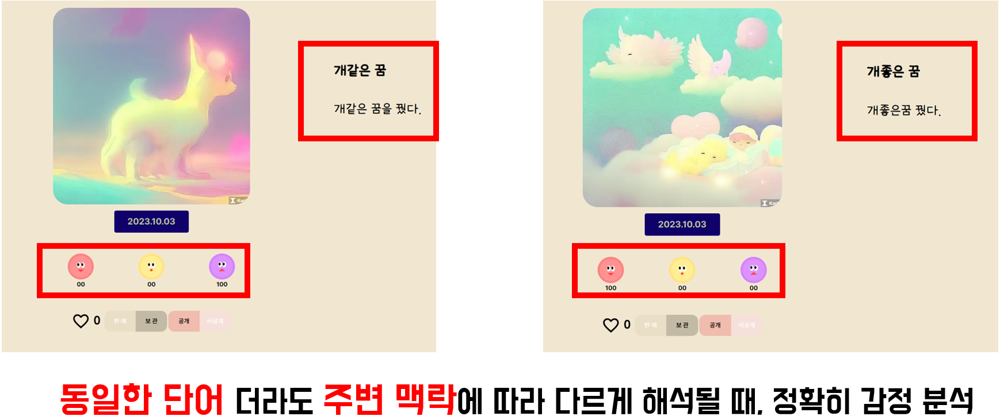
</div>

### 2. 빅데이터 파이프라인

<div align=center>
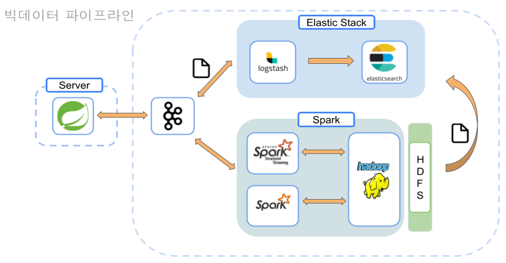
</div>

### 3. 검색페이지 : 오타 교정, 한/영변환

<div align=center>
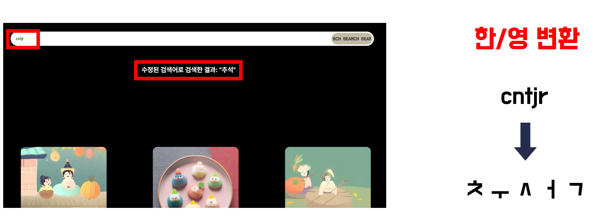
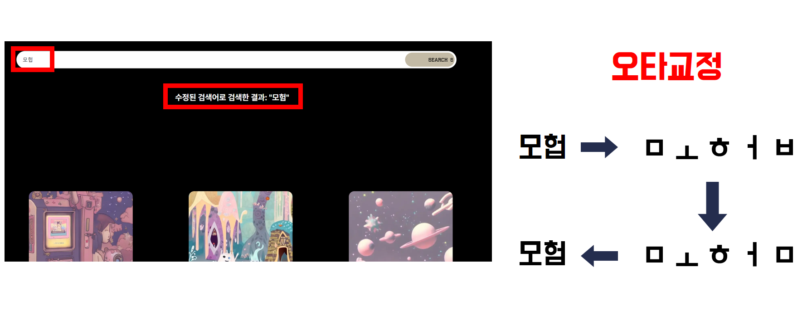

</div>

<br/>

<br/>
<!------- 팀원 소개 시작 -------->

## 👥 팀원 소개

<a name="developers"></a>

|   **Name**   |                       윤자현                       |                       김동현                       |                       김현빈                       |                       정수완                       |                                      이승민                                       |                       조현덕                       |                       차민준                       |
| :----------: | :------------------------------------------------: | :------------------------------------------------: | :------------------------------------------------: | :------------------------------------------------: | :-------------------------------------------------------------------------------: | :------------------------------------------------: | :------------------------------------------------: |
| **Profile**  |  |  |  |  |                                 |  |  |
| **Position** |               Leader <br/> Frontend                |                      Frontend                      |                      Frontend                      |                      Frontend                      |                                      Backend                                      |                      Backend                       |                      Backend                       |
|   **Git**    |      [GitHub](https://github.com/YOONJAHYUN)       |     [GitHub](https://github.com/dongdongx2x2)      |     [GitHub](https://github.com/HyeonBhinKim)      |       [GitHub](https://github.com/SWan9710)        | [GitHub](https://github.com/SMin1620) <br/> [Blog](https://smin1620.tistory.com/) |       [GitHub](https://github.com/whwhdnfl2)       |      [GitHub](https://github.com/gusejr4547)       |

<!------- 업무 분장 시작 -------->

## 💡 업무 분장

<a name="divisionOfDuties"></a>

#### FrontEnd

- **윤자현** : UI/UX 구현, 요구사항 분석 및 설계, three.js 및 애니메이션을 사용해 인터렉티브 화면 구현
- **김동현** : UI/UX 구현, Redux, React Query를 활용해 데이터 상태 관리, 인터렉티브 메인 화면 구현

- **김현빈** : UI/UX 구현, three.js 및 애니메이션을 사용해 인터렉티브 화면 구현, 성능 최적화
- **정수완** : UI/UX 구현, CR(Create, Read) 기능 구현해 전반적인 페이지 개발, 반응형 웹 디자인 구현
  <br/>

#### BackEnd

- **이승민** : spring boot api 개발, ELk Stack을 활용한 로그 관리 및 데이터 분석, 검색엔진, 거래내역 이상징후 탐지, 추천기능
- **차민준** : spring boot api 개발, jenkins/docker를 활용한 ci/cd 자동화 구축 spark를 활용한 빅데이터 분석
- **조현덕** : 빅데이터 시스템 구축, spark를 활용한 빅데이터 분석, spark streaming을 실시간 데이터 처리, spring boot api 개발
